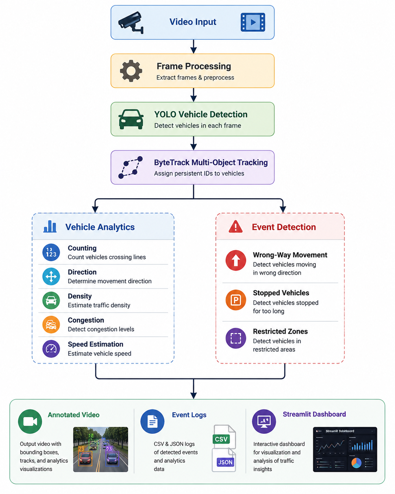
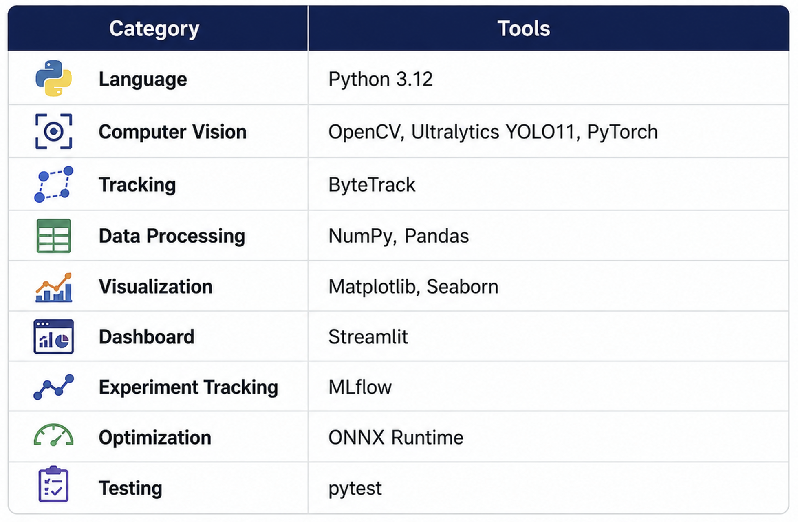
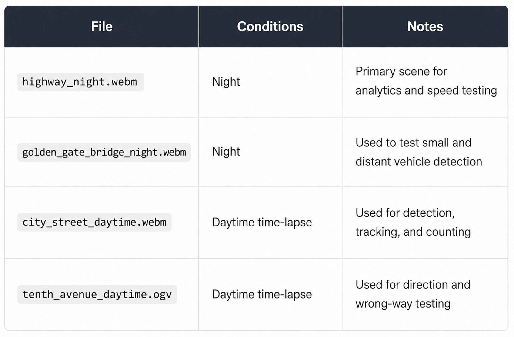
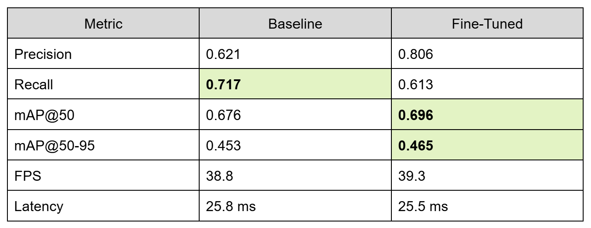
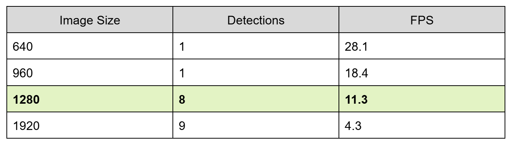
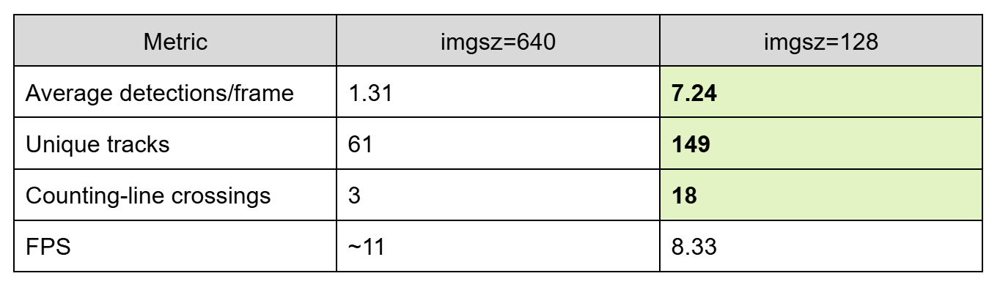
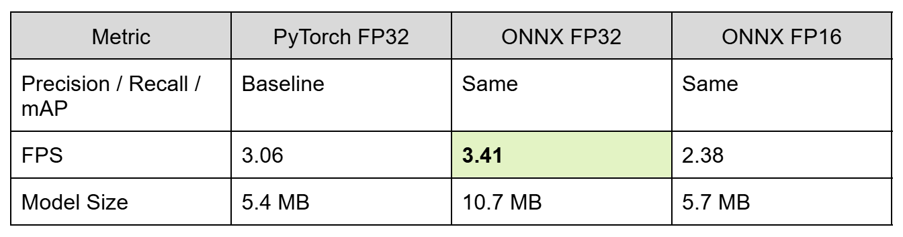
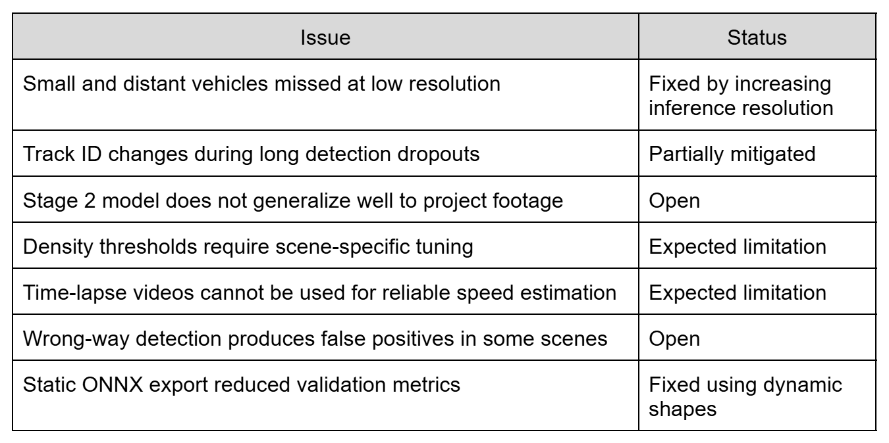

# Real-Time Traffic Intelligence

A computer vision project for analyzing traffic footage using vehicle detection, multi-object tracking, traffic analytics, and event detection.

The system processes traffic video and can detect and track vehicles, count them as they cross configured lines, estimate direction and traffic density, detect selected traffic events, and display results through an annotated video pipeline and Streamlit dashboard.

## Features

- Vehicle detection and classification using YOLO11
- Multi-object tracking with ByteTrack
- Persistent vehicle IDs and trajectory history
- Vehicle counting using configurable virtual lines
- Screen-relative direction detection
- Traffic density and congestion estimation
- Wrong-way vehicle detection
- Stopped-vehicle detection
- Restricted-zone detection
- Approximate vehicle speed estimation
- CSV and JSON event logging
- Streamlit analytics dashboard
- MLflow experiment tracking
- Baseline vs. fine-tuned model evaluation
- ONNX inference optimization
- Unit tests and failure analysis

## Architecture



## Tech Stack



Development and local inference were performed on a CPU-only machine. Model training for the larger dataset was run using Google Colab GPU resources.

---

# Dataset

## Sample Traffic Footage

The project uses four fixed-camera traffic clips for testing the pipeline and validating scene-based analytics.



The time-lapse clips are not used for speed estimation because the real elapsed time between frames is not preserved. The project uses fixed-camera footage because line counting, zones, and scene calibration depend on a stable camera position.

All four clips are sourced from Wikimedia Commons under their original Creative Commons licenses:

| File | Source | License |
|---|---|---|
| `highway_night.webm` | [Cars_driving_at_night.webm](https://commons.wikimedia.org/wiki/File:Cars_driving_at_night.webm) | CC BY 3.0 |
| `golden_gate_bridge_night.webm` | [Traffic_on_bridge_at_night.webm](https://commons.wikimedia.org/wiki/File:Traffic_on_bridge_at_night.webm) | CC BY 3.0 |
| `city_street_daytime.webm` | [City_street_time_lapse.webm](https://commons.wikimedia.org/wiki/File:City_street_time_lapse.webm) | CC BY 3.0 |
| `tenth_avenue_daytime.ogv` | [Time-lapse above 10th Avenue, New York.ogv](https://commons.wikimedia.org/wiki/File:Time-lapse_above_10th_Avenue,_New_York.ogv) | CC BY-SA 2.0 |

The videos are not included in the repository because of their size. Download commands are provided below.

## Training Datasets

### Stage 1

The first dataset was used to validate the complete training and evaluation pipeline.

- 1,254 images
- 5 classes: Ambulance, Bus, Car, Motorcycle, Truck
- Train: 878
- Validation: 250
- Test: 126
- Image size: 416 × 416
- Source: [Roboflow Universe – vehicles-openimages](https://universe.roboflow.com/roboflow-gw7yv/vehicles-openimages), CC BY 4.0

### Stage 2

A larger traffic dataset was used for additional fine-tuning experiments.

- 9,211 images
- 58,324 labeled objects
- 6 classes: bus, car, microbus, motorbike, pickup-van, truck
- Image size: 640 × 640
- Re-split into 80/10/10 train, validation, and test sets
- Source: [Roboflow Universe – vehicle-detection](https://universe.roboflow.com/lynkeus03/vehicle-detection-by9xs), CC BY 4.0

The original dataset did not contain usable validation or test splits, so the project re-split the images using a fixed random seed for reproducibility.

---

# Setup

Tested with Python 3.12 on Windows 11.

```powershell
py -3.12 -m venv .venv

.\.venv\Scripts\python.exe -m pip install --upgrade pip

.\.venv\Scripts\python.exe -m pip install torch torchvision --index-url https://download.pytorch.org/whl/cpu

.\.venv\Scripts\python.exe -m pip install -r requirements.txt
```

## Download Sample Videos

```powershell
curl.exe -L -o data/raw/samples/highway_night.webm "https://upload.wikimedia.org/wikipedia/commons/8/82/Cars_driving_at_night.webm"

curl.exe -L -o data/raw/samples/golden_gate_bridge_night.webm "https://upload.wikimedia.org/wikipedia/commons/4/4d/Traffic_on_bridge_at_night.webm"

curl.exe -L -o data/raw/samples/city_street_daytime.webm "https://upload.wikimedia.org/wikipedia/commons/e/e1/City_street_time_lapse.webm"

curl.exe -L -o data/raw/samples/tenth_avenue_daytime.ogv "https://upload.wikimedia.org/wikipedia/commons/b/b9/Time-lapse_above_10th_Avenue%2C_New_York.ogv"
```

## Roboflow API Key (training only)

Only needed for `training/download_dataset.py` / `training/prepare_dataset.py` — not for running inference on the sample videos above.

```powershell
copy .env.example .env
```

Add your key from `app.roboflow.com/settings/api` to `.env` as `ROBOFLOW_API_KEY`. `.env` is gitignored and never committed.

---

# Running Inference

Run vehicle detection on a video:

```powershell
.\.venv\Scripts\python.exe -m src.inference --source data/raw/samples/highway_night.webm
```

Run tracking and analytics:

```powershell
.\.venv\Scripts\python.exe -m src.inference --source data/raw/samples/highway_night.webm --analytics
```

Run event detection:

```powershell
.\.venv\Scripts\python.exe -m src.inference --source data/raw/samples/highway_night.webm --events
```

Run approximate speed estimation:

```powershell
.\.venv\Scripts\python.exe -m src.inference --source data/raw/samples/highway_night.webm --events --speed
```

Output videos are saved in:

```text
outputs/videos/
```

---

# Training

The initial fine-tuning experiment uses YOLO11n.

```powershell
.\.venv\Scripts\python.exe -m training.train --epochs 30 --name stage1_finetune
```

The Stage 1 experiment used:

- YOLO11n
- 30 epochs
- Image size: 416
- Batch size: 8

Training outputs include model weights, training curves, precision-recall curves, F1 curves, and confusion matrices.

The Stage 2 experiment (larger dataset, tuned augmentation) needs more compute than the local CPU setup, so it runs on Google Colab via `notebooks/stage2_augmented_training.ipynb`.

---

# Results

## Baseline vs. Stage 1 Fine-Tuned Model

The baseline and fine-tuned models were evaluated using the overlapping vehicle classes:

- Bus
- Car
- Motorcycle
- Truck



The fine-tuned model improved precision and produced a small improvement in mAP, while recall decreased. The full fine-tuned model also included an Ambulance class that was not included in the baseline comparison.

## Stage 2 Training Result

The larger Stage 2 model performed well on its own held-out test data but did not perform well on the project's sample traffic footage.

This was mainly caused by a mismatch between the training data and the target footage. The Stage 2 dataset contained mostly daytime, close-range traffic, while the project footage includes elevated cameras, night scenes, and small or distant vehicles.

For that reason, the Stage 2 model is kept as an experiment and is not the default inference model.

This became one of the project's main findings: better validation metrics on a dataset do not necessarily mean better performance in the actual target environment.

---

# Small and Distant Vehicle Detection

One issue discovered during testing was that the model missed many small and distant vehicles when using the default inference image size.

The same model was tested at different inference resolutions:



Based on the detection and speed trade-off, `imgsz=1280` became the default setting.

On the full `golden_gate_bridge_night.webm` clip:



Increasing inference resolution improved small-vehicle detection without requiring additional training.

---

# Traffic Analytics

The analytics pipeline supports:

### Vehicle Counting

Vehicles are counted when tracked IDs cross configurable virtual lines. Each vehicle is counted once per line.

### Direction Detection

Vehicle movement is classified using screen-relative directions:

```text
UP
DOWN
LEFT
RIGHT
UP-LEFT
UP-RIGHT
DOWN-LEFT
DOWN-RIGHT
```

### Traffic Density

Traffic density is estimated from the number of active tracked vehicles.

### Congestion Detection

Congestion detection uses both traffic density and vehicle movement instead of vehicle count alone.

---

# Event Detection

The system supports three event types:

### Wrong-Way Detection

Tracks moving opposite to the configured expected direction can be flagged.

This feature is currently limited because different traffic regions in the same frame can have different valid directions. It is enabled only for scenes where a single expected direction is appropriate.

### Stopped Vehicle Detection

Vehicles can be flagged when they remain nearly stationary for a configurable period.

### Restricted-Zone Detection

Vehicle positions are checked against configured polygon zones.

Events are saved in:

```text
outputs/events/
```

Both CSV and JSON logs are generated.

---

# Approximate Speed Estimation

The project can display estimated vehicle speed based on:

- Pixel movement
- Video frame timing
- A manually configured pixel-to-meter reference

Speed values are labeled as estimates because the current implementation does not perform full camera calibration or perspective correction.

The feature is intended for approximate traffic analysis and should not be considered a precise or enforcement-grade speed measurement.

---

# Streamlit Dashboard

Run the dashboard with:

```powershell
.\.venv\Scripts\python.exe -m streamlit run dashboard/app.py
```


The dashboard includes:

- Annotated video output
- Vehicle detection and tracking metrics
- Traffic density and congestion information
- Vehicle distribution by class
- Traffic charts
- Estimated speed information
- Event logs

The dashboard uses the same underlying processing pipeline as the command-line application.

---

# Experiment Tracking

Training and evaluation experiments are tracked locally with MLflow.

Logged information includes:

- Model configuration
- Dataset
- Epochs
- Batch size
- Learning rate
- Image size
- Precision
- Recall
- mAP
- FPS
- Latency
- Model artifacts

The project uses a local SQLite backend for MLflow tracking.

---

# ONNX Optimization

The default YOLO model was exported to ONNX and tested against the original PyTorch model.



ONNX FP32 provided approximately an 11% speed improvement on the CPU used for testing.

FP16 was slower on this CPU, so the FP32 ONNX model is the recommended optimized version.

---

# Failure Analysis

The project includes several known limitations and failure cases:



Detailed investigation is available in:

```text
docs/failure_analysis.md
```

---

# Limitations

- Speed estimation is approximate and does not include full perspective correction.
- Traffic density and congestion thresholds need to be configured for each camera.
- Tracking IDs can change after extended detection failures.
- Wrong-way detection currently does not support separate direction rules for different regions of the same frame.
- Time-lapse footage is not suitable for speed or dwell-time analysis.
- Local inference was tested primarily on CPU hardware.

---

# Project Structure

```text
real-time-traffic-classifier/
│
├── configs/
│   ├── analytics.yaml
│   ├── analytics_city_street.yaml
│   ├── analytics_golden_gate.yaml
│   └── analytics_tenth_avenue.yaml
│
├── dashboard/
│   └── app.py
│
├── data/
│   ├── raw/
│   └── processed/
│
├── docs/
│   └── failure_analysis.md
│
├── evaluation/
│   ├── compare_models.py
│   ├── metrics.py
│   └── optimize.py
│
├── models/
│
├── notebooks/
│   └── stage2_augmented_training.ipynb
│
├── outputs/
│
├── src/
│   ├── detection.py
│   ├── tracking.py
│   ├── counting.py
│   ├── event_detection.py
│   ├── speed_estimation.py
│   ├── video_processor.py
│   └── inference.py
│
├── training/
│   ├── train.py
│   └── prepare_dataset.py
│
├── tests/
│
├── requirements.txt
└── README.md
```

---

# Project Status

- [x] YOLO vehicle detection
- [x] Multi-object tracking with ByteTrack
- [x] Vehicle trajectory tracking
- [x] Virtual-line vehicle counting
- [x] Direction analysis
- [x] Traffic density estimation
- [x] Congestion detection
- [x] Wrong-way detection
- [x] Stopped-vehicle detection
- [x] Restricted-zone detection
- [x] CSV and JSON event logging
- [x] Approximate speed estimation
- [x] Streamlit dashboard
- [x] Stage 1 model fine-tuning
- [x] Stage 2 fine-tuning experiment
- [x] Baseline and fine-tuned model comparison
- [x] MLflow experiment tracking
- [x] ONNX optimization
- [x] Failure analysis
- [x] Unit tests

---

# Future Improvements

- Improve night-time and small-object detection with better matched training data
- Add region-aware wrong-way detection
- Use proper camera calibration for more accurate speed estimation
- Support RTSP and live CCTV streams
- Explore edge deployment and additional optimization
- Expand the training dataset and supported vehicle classes
