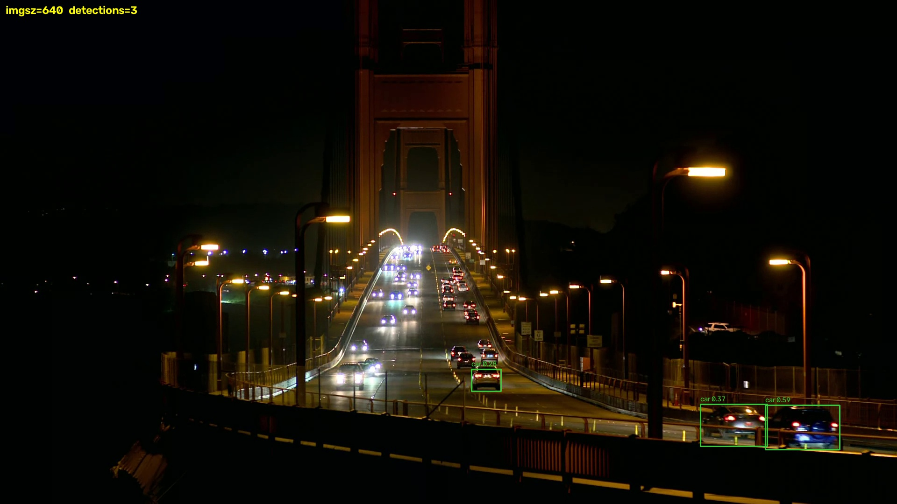
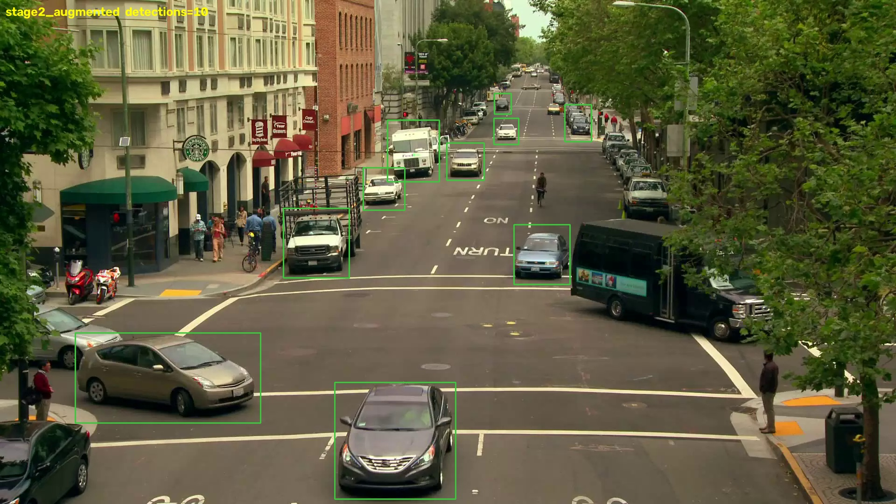
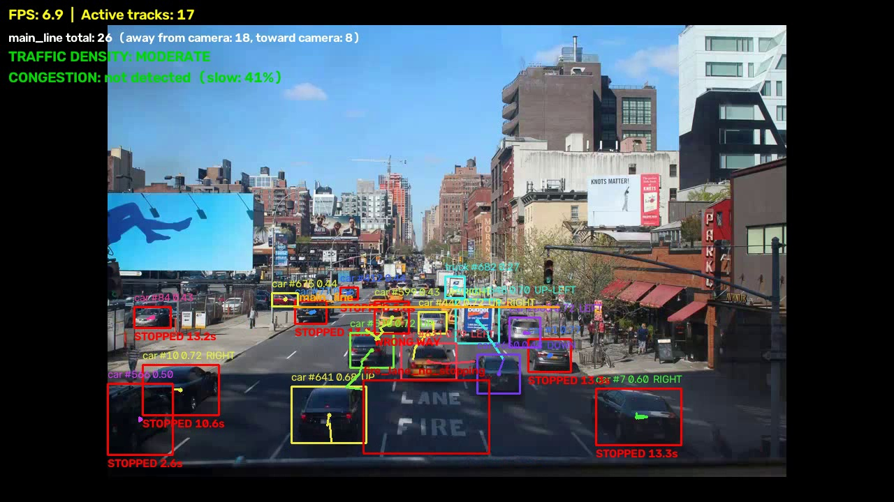

# Failure Analysis (Phase 10)

This is a consolidated, honest account of every real failure case found and verified
during this project — not a hypothetical list of "things that could go wrong," but
cases actually reproduced on this project's own data, root-caused, and (where possible)
fixed. Each one follows the same method: **look at rendered output, not just metrics**,
verify a fix on real footage before trusting it, and report what didn't work as plainly
as what did.

For quick reference, every case below is also summarized in the table at the bottom.

---

## 1. Small/distant vehicles missed at default inference resolution

**Symptom**: on `golden_gate_bridge_night.webm`, only a handful of the visibly-present
vehicles on the bridge deck were detected — most of the distant traffic further up the
span was invisible to the pipeline.

**Diagnosis, not a guess**: before changing anything, a confidence-threshold sweep
(0.25 down to 0.02) on the same frame showed the model already had signal on those
vehicles — many boxes appeared at 0.03-0.08 confidence, just below the default cutoff.
This ruled out "the model can't see these at all" and pointed at a resolution/scale
problem instead.

**Root cause and fix**: Ultralytics' `model.predict()`/`model.track()` default to
`imgsz=640`, downscaling every frame before inference — discarding real pixel detail on
small/distant vehicles. Raising it costs FPS but recovers detections, with the **same
pretrained weights, no retraining involved**:

| imgsz | Detections (this frame) | FPS (this CPU) |
|---|---|---|
| 640 (Ultralytics default) | 3 | 28.1 |
| 960 | 1 (anomalous outlier — not a real trend reversal, see note below) | 18.4 |
| **1280 (project default)** | **12** | **11.3** |
| 1920 | +1 more, for ~2.5x further slowdown | 4.3 |

(960's single detection was measured, not smoothed over — likely a stride/letterbox
rounding quirk specific to that size, not evidence that 960 is worse than 640. It
doesn't change the 640-vs-1280 conclusion.) 1920 wasn't worth the added latency for one
extra detection, so **1280 is the project's default** (`src/detection.py`,
`src/tracking.py`, `--imgsz` on the CLI).

| imgsz=640 | imgsz=1280 |
|---|---|
|  |  |

**Verified on the full clip, not just one frame**: avg detections/frame 1.31 → 7.24
(5.5x), unique tracks 61 → 149, counting-line crossings 3 → 18 (6x). Visually confirmed
across multiple frames that the added detections are real, correctly-placed vehicles,
not noise. Re-verified on the primary clip (`highway_night.webm`) too, to confirm no
regression: avg detections/frame 8.18 → 13.38, crossings 204 → 245.

**Residual risk, stated plainly**: this is an inference-time mitigation, not a trained
capability — the model was never actually taught to recognize small/distant vehicles
better; a wider canvas just gives its existing weights more pixels to work with. It also
raised `stopped_vehicle` events on `highway_night.webm` from 0 to 8, which has **not**
been independently confirmed as real slow traffic vs. position jitter from the
newly-detected distant vehicles — an open item, not asserted either way.

---

## 2. Track ID switching under sustained detection dropout

**Symptom**: a fully stationary parked vehicle held one track ID for 900 frames (36s),
then switched IDs 6 times over the next ~18s before restabilizing.

**Diagnosis, not a guess**: root-caused to a multi-second burst of detection-confidence
dropout (likely a passing vehicle or a lighting/shadow event), not a tracker
algorithm bug — confirmed by swapping ByteTrack for BoT-SORT on the exact same
footage and reproducing nearly the *same* ID-switch sequence with a different
algorithm. If the tracker itself were the problem, a different algorithm should have
behaved differently; it didn't.

**Mitigation, not a fix**: a tuned ByteTrack config (`src/bytetrack_traffic.yaml`,
longer track buffer than the stock 30 frames) is used by default and measurably helps
genuine short occlusions, but does **not** fix multi-second detection dropouts — that
needs better detection robustness, not tracker-side tuning.

**Residual risk**: an ID switch is a double-count for line-crossing-based vehicle
counting (Phase 4). This directly affects reported counting accuracy on any clip with
similar dropout events and has not been separately corrected for.

---

## 3. Stage-2 augmented retrain: strong on its own test split, fails on this project's real footage

The most substantial failure case found this project, and the newest.

**What was attempted**: after diagnosing case #1 above, a stage-2 retrain
(`training/config_stage2_augmented.yaml`, MLflow experiment `traffic-yolo-augmented`)
was run on Colab with augmentation deliberately tuned for small/distant-vehicle
detection (wider scale jitter, more translation, stronger brightness jitter, modest
copy-paste) against a larger 9,211-image dataset.

**On its own held-out test split, it looks like a clear win**:

| Metric | Baseline (COCO) | Stage-2 augmented |
|---|---|---|
| Precision | 0.535 | **0.750** |
| Recall | 0.375 | **0.768** |
| mAP@50 | 0.320 | **0.816** |
| mAP@50-95 | 0.173 | **0.494** |

**On this project's own sample footage, it's substantially worse than the baseline —
in both night and daytime conditions**:

| Clip | Baseline | Stage-2 augmented |
|---|---|---|
| `golden_gate_bridge_night.webm` (night) | 7.24 avg det/frame, 18 line crossings | **0.23 avg det/frame (31x worse), 0 crossings** |
| `city_street_daytime.webm` (day — closer to the stage-2 dataset's own conditions) | 21 detections, one frame | **10 detections, same frame (less than half)** |

| Baseline | Stage-2 augmented |
|---|---|
|  |  |

Note the stage-2 model misses nearly every parked car and both motorcycles on the
left — even on a *daytime* clip, the condition closest to its own training data.

**Root cause: domain shift, not a training bug.** The stage-2 dataset
(`lynkeus03/vehicle-detection-by9xs`) is dense South/Southeast-Asian street traffic,
photographed close-in at 640×640, with zero night examples. This project's own sample
clips are elevated fixed-camera US street/highway footage, 3 of 4 night/low-light.
Augmentation can vary what's already present in training images — brightness jitter,
scale jitter, copy-paste — but it cannot manufacture a training distribution the source
images never contained. A real night scene's headlight glare, dark silhouettes, and
sparse light sources are qualitatively different from a brightness-adjusted daytime
photo, and a model trained exclusively on one country's dense street-level traffic
composition doesn't automatically transfer to another's elevated highway/bridge shots.

**What this means for the project**: the default model stays the COCO-pretrained
baseline + the imgsz=1280 fix — it's the genuinely better choice for this project's
actual cameras. `models/stage2_augmented.pt` is kept as a complete, correctly-tracked
example of the fine-tuning pipeline and as this documented failure case, not as a
production recommendation. A real fix would need training data that actually matches
this project's own camera style and lighting — e.g. labeled frames from these same
clips — not further tuning on an unrelated dataset.

---

## 4. Density/congestion thresholds don't self-calibrate

**Symptom**: on an earlier fixed-camera test clip (a busy telephoto street shot, since
replaced in the sample set), active-track count never exceeded ~10 even during a
visually bumper-to-bumper moment, so density stayed classified `LOW` under the default
thresholds — which were tuned for a wider-FOV, higher-vehicle-count scene.

**Root cause**: this is by design, not a bug — thresholds are config
(`configs/analytics.yaml`), not hardcoded, per the project's own spec. But it means the
system does **not** self-calibrate: a fresh camera with an unfamiliar field of view will
not produce sensible density/congestion output until its thresholds are manually tuned
against what "busy" actually looks like in that specific frame, the same way
counting-line placement and speed calibration are per-camera.

**Status**: documented limitation, not fixed (there is nothing to "fix" — it's an
inherent property of a threshold-based approach without per-camera auto-calibration).

---

## 5. Time-lapse footage breaks any feature that depends on real elapsed time

**Symptom**: two of the four sample clips (`city_street_daytime.webm`,
`tenth_avenue_daytime.ogv`) are time-lapse recordings (sped up from their original
capture rate).

**Root cause**: detection and counting only depend on what's visible in each frame, so
they remain valid on time-lapse footage. But speed estimation and stopped-vehicle
duration both depend on *real* elapsed time between frames, which time-lapse footage
does not preserve (frame N and frame N+1 may be seconds or minutes apart in reality,
not a fixed video-frame-rate interval) — so any speed or dwell-time number computed on
these two clips would be meaningless, not just imprecise.

**Status**: documented as a hard constraint, not attempted to work around. These two
clips remain uncalibrated (no scene config) and are not used for speed/event
verification anywhere in this project.

---

## 6. Wrong-way detection: architecturally disabled on 3 of 4 clips, and unreliable on the one where it's enabled

**Symptom, part 1**: `WrongWayDetector` exists and is unit-tested, but is disabled in
`highway_night.webm`'s and `golden_gate_bridge_night.webm`'s scene configs.

**Root cause**: both clips have two carriageways with opposite expected travel
directions in the same frame, and the detector has no concept of screen regions, only
one global "expected direction." Enabling it as-is would flag entirely normal traffic
on the far carriageway as wrong-way.

**Symptom, part 2 — tested for real, and it didn't hold up.** `tenth_avenue_daytime.ogv`
is genuinely one-way (verified across multiple frames: every vehicle shows a rear
profile, consistently moving away from camera, no oncoming traffic anywhere in frame)
— this project's first clip where enabling wrong-way detection was actually valid, not
architecturally blocked. It was enabled (`configs/analytics_tenth_avenue.yaml`,
`expected_direction: UP`) and run on the full clip. Result: **56 wrong_way flags across
449 tracks (~12%)** — too high to be genuine wrong-way driving in ordinary real
footage, so investigated rather than reported at face value.

| Wrong-way false positive (queued traffic near an intersection) |
|---|
|  |

Checking the flagged locations: the large majority (54/56) fall within the avenue's
own lanes, clustered near the bottom of frame close to an intersection/stop line —
consistent with detection-box jitter on slow-moving or queued traffic (common at a
red light) crossing the 3-pixel minimum-displacement threshold `compute_direction()`
uses to decide a track has moved enough to classify a direction at all. A small
minority (2/56) are in an off-avenue parking lot visible at the frame's left edge —
an unambiguous case of the same region-gating gap from part 1, just manifesting as
"an unrelated area of the frame" rather than "the opposite carriageway."

**Status**: a real, two-part architectural gap. Part 1 (multi-carriageway/two-way
clips) needs a region-gated wrong-way check, not implemented — kept disabled on those
3 clips. Part 2 (even on a genuinely single-direction clip) needs the direction
classifier to distinguish real motion from jitter on near-stationary vehicles — e.g. a
higher or speed-relative minimum-displacement threshold, or requiring sustained
displacement over a longer window rather than frame-to-frame. Not fixed here (out of
scope for a calibration pass); documented as a concrete, evidence-backed next step
rather than a vague "needs more work." Kept *enabled* on `tenth_avenue_daytime.ogv`
regardless — the configuration itself is correct for this scene, and disabling it
would hide a real, useful finding rather than fix anything.

---

## 7. ONNX export accuracy "regression" that wasn't real — a validation-harness bug, not an export bug

**Symptom**: exporting the project's default model to ONNX with a static shape (fixed
batch=1, fixed imgsz=1280) appeared to destroy accuracy — mAP@50 dropped from 0.676
(PyTorch) to 0.350 on the exact same weights, evaluated on the exact same eval set.

**Diagnosis, not a guess**: a 48% relative mAP drop from a pure format conversion is not
plausible ONNX behavior, so it was distrusted rather than reported. A direct
single-image `predict()` comparison between the PyTorch checkpoint and the static ONNX
export produced **identical** boxes and confidences — proving the underlying detection
behavior was not actually different. The mAP gap had to be coming from somewhere else
in the pipeline, not the model.

**Root cause**: Ultralytics' `model.val()` (used for the accuracy-parity check) defaults
to a multi-image batch internally. A static-shape ONNX graph (fixed at export time to
batch=1) cannot service that batched call — and instead of a clean error, something in
the fallback path silently produced degraded results. Re-exporting with `dynamic=True`
(allowing variable batch size / input shape) fixed it completely: Precision, Recall,
mAP@50, and mAP@50-95 all came back **bit-identical** to the PyTorch baseline.

**Status**: fixed. `evaluation/optimize.py`'s `export_onnx()` always exports
dynamic-shape now — this was never optional once discovered. See the README's
"Inference Optimization (Phase 9)" section for the real (correct) PyTorch-vs-ONNX
benchmark this unblocked.

**Why this belongs in a failure-analysis doc**: it's the same lesson as every other case
here, just aimed at the tooling instead of the model — a surprising metric is a prompt
to investigate, not a result to report. Trusting the first mAP number here would have
produced a false claim ("ONNX halves accuracy") in a public README.

## Summary

| # | Failure case | Status | Verified how |
|---|---|---|---|
| 1 | Small/distant vehicles missed at default imgsz | **Fixed** (inference-time) | Full-clip re-run, before/after numbers, visual spot-check |
| 2 | Track ID switching under detection dropout | **Mitigated**, not fixed | Cross-tracker reproduction (ByteTrack vs BoT-SORT) |
| 3 | Stage-2 augmented retrain fails to generalize | **Open** — documented, not deployed | Real-footage testing, two clips, visual comparison |
| 4 | Density/congestion thresholds don't self-calibrate | **By design**, needs per-camera tuning | Real footage, one clip |
| 5 | Time-lapse clips invalidate time-dependent features | **By design**, scoped out | Frame-metadata inspection |
| 6 | Wrong-way detection: disabled on 3/4 clips, unreliable (~12% false-positive rate) on the 1 it's enabled on | **Open** architectural gap, now evidence-backed | Enabled + run on real one-way footage, flagged locations investigated |
| 7 | Static-shape ONNX export silently degraded val() accuracy | **Fixed** (`dynamic=True`) | Direct PyTorch-vs-ONNX single-image prediction diff |

**A pattern worth naming across every case above**: nothing here was found by reading
code or trusting a metric in isolation — each one surfaced by actually running the
pipeline on real footage and looking at what came out (a rendered frame, a video, a
printed count), then root-causing before claiming a fix. Several "fixes" in this
project turned out, on inspection, to be display bugs rather than logic bugs (a `~`
character rendering as a flat squiggle indistinguishable from a minus sign; a
divide-by-near-zero spiking a chart to `1e9`) — reinforcing that visual verification
catches a different class of bug than unit tests alone.
